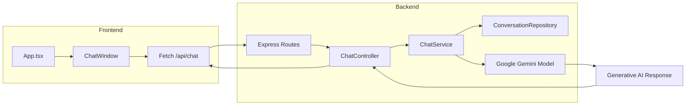
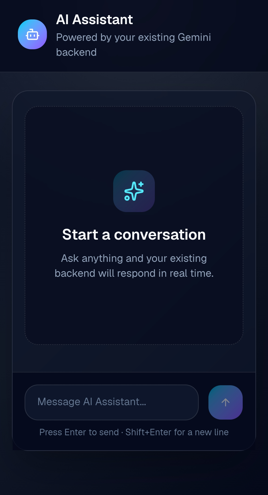
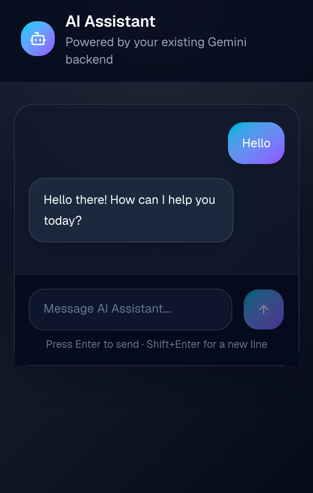

# AI Assistant Chat App


A full-stack TypeScript monorepo with a React/Vite/Tailwind frontend and a Bun/Express backend. The application sends prompt text to Google Gemini and returns assistant responses in a conversational UI.

## Live Demo
- **Frontend demo(Try the AI Assistant)**: `https://ai-assistant-client-omega.vercel.app/`
- **Backend API**: `https://ai-assistant-vrf3.onrender.com/api/chat`

## Overview
This repository contains a modern chat assistant that connects a styled web client to a generative AI backend. It demonstrates frontend/backend separation, session-aware chat state, API validation, and external AI service integration.

## Key Features
- Interactive chat UI with user and assistant message states
- Prompt submission to `/api/chat` for AI generation
- Session-aware conversation ID stored in `sessionStorage`
- Backend input validation with Zod
- In-memory chat session repository for ongoing conversations
- Monorepo structure for client and server packages

## Resume Highlights
- Built a full-stack TypeScript monorepo using Bun, React 19, Vite, and Express
- Integrated Google Generative AI SDK for conversational assistant workflows
- Implemented request validation and session management in the backend
- Designed a responsive chat UI with keyboard controls and error handling
- Orchestrated concurrent frontend/backend development from root workspace

## Tech Stack
- Bun
- TypeScript
- React 19
- Vite
- Tailwind CSS
- shadcn UI
- Express 5
- Google Generative AI SDK
- Zod
- CORS

## Architecture
The app is split into frontend and backend packages inside a Bun workspace.

### Architecture Diagram


### How it works
- `packages/client` handles UI, message state, and network requests.
- `packages/server` exposes Express routes and integrates with Google Gemini.
- Chat state is associated with `conversationId` values stored in sessionStorage.
- `ConversationRepository` preserves an in-memory chat instance per session.

## Folder Structure
```
/
├─ index.ts
├─ package.json
├─ packages/
│  ├─ client/
│  │  ├─ package.json
│  │  ├─ src/
│  │  │  ├─ App.tsx
│  │  │  ├─ main.tsx
│  │  │  ├─ components/
│  │  │  │  ├─ chat-window.tsx
│  │  │  │  └─ ui/button.tsx
│  │  │  ├─ lib/utils.ts
│  │  │  └─ types/chat.ts
│  │  ├─ tsconfig.json
│  │  └─ vite.config.ts
│  └─ server/
│     ├─ package.json
│     ├─ index.ts
│     ├─ controllers/chat.controller.ts
│     ├─ services/chat.service.ts
│     ├─ repositories/conversation.repository.ts
│     └─ routes/index.ts
```

## Installation
```bash
cd d:/Devo/AI/my-app
bun install
```

## Environment Variables
- `GOOGLE_API_KEY` — required by the backend to call Google Generative AI
- `PORT` — optional server port, defaults to `3000`

> The frontend currently uses a hardcoded deployed backend API endpoint in `packages/client/src/App.tsx`. Update it for local development if needed.

## Local Development
Run both services from the repository root:
```bash
bun run index.ts
```

Or run them separately:
```bash
cd packages/server
bun run dev
```

```bash
cd packages/client
bun run dev
```

## Deployment
### Vercel
- Deploy the frontend from `packages/client`
- Build command: `bun run build`
- Output directory: `dist`
- Ensure environment variables are configured for production

### Render
- Deploy the backend from `packages/server`
- Start command: `bun run start`
- Set `GOOGLE_API_KEY`
- Configure `PORT` as required

## API Endpoints
- `GET /` — returns `{ "message": "Hello, world!" }`
- `GET /api/hello` — returns `{ "message": "Hello, world!" }`
- `POST /api/chat`
  - Request body:
    ```json
    {
      "prompt": "string",
      "conversationId": "uuid"
    }
    ```
  - Response:
    ```json
    {
      "message": "string"
    }
    ```

## Project Screenshots






## Future Improvements
- Replace hardcoded client backend URL with environment configuration
- Add persisted conversation storage for history and recovery
- Add automated tests for backend and frontend flows
- Add CI/CD and linting pipeline
- Add project license and contribution guidelines

## Acknowledgements
- Google Gemini generative AI for backend model integration
- Bun for modern runtime and monorepo workspace support
- Tailwind CSS, shadcn UI, and Radix for polished frontend presentation

## License
No license file detected in this repository. Add a license such as MIT or Apache 2.0 to define usage and contribution terms.
